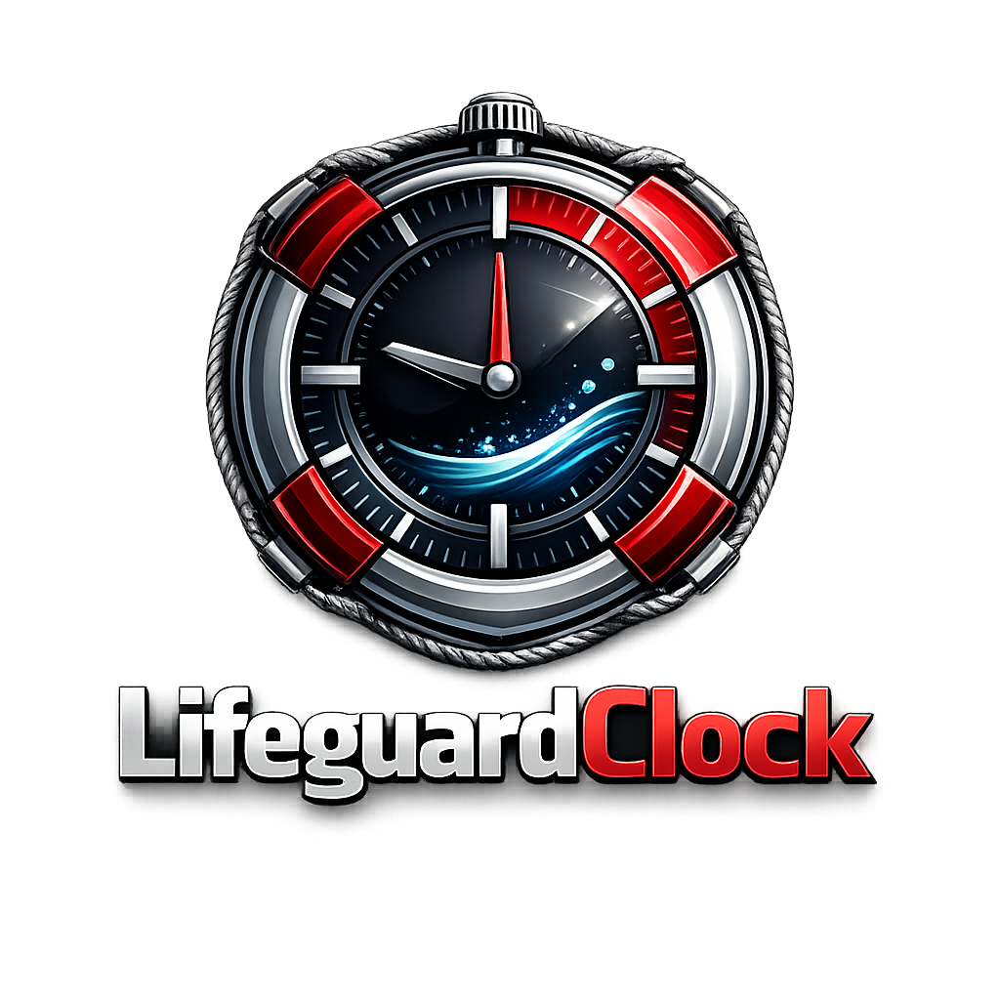

<p align="center">
  
</p>

<h1 align="center">LifeguardClock</h1>
<p align="center"><em>Zeiterfassung für Rettungsschwimmer</em></p>

<p align="center">
  Digitale Stempeluhr für Vereine — entwickelt für die DLRG, frei konfigurierbar für jede Organisation.<br>
  Erfasst Anwesenheit und beliebige Dienst-Typen (Wachdienst, Sanitätsdienst …) mit automatischen Regeln wie<br>
  Zeitlimits, Pflichtpausen, gegenseitiger Sperre und Berechtigungen pro Mitglied.
</p>

---

→ **[Vollständige Dokumentation](DOKUMENTATION.md)**

---

## Dateien auf einen Blick

| Datei | Zweck |
|---|---|
| **`LifeguardClock.html`** | Haupt-App — Stempeln, Admin, Cloud-Sync |
| **`admin.html`** | Benutzerverwaltung — Nutzer, PINs, Berechtigungen zentral pflegen |
| **`dashboard.html`** | Auswertungs-Dashboard — Stundenübersicht aus Cloud-Daten |
| **`editor.html`** | Log-Editor — Einträge nachträglich korrigieren |
| **`einmalpins.html`** | Einmal-PIN-Übersicht für den Druck *(lokal, nicht im Repo)* |
| **`config.js`** | Eigene Konfiguration *(nicht im Repo, aus Vorlage erstellen)* |
| **`config.example.js`** | Vorlage mit allen Optionen und Kommentaren |
| **`presets/config.dlrg.js`** | Fertiges Preset für DLRG-Ortsgruppen |
| **`presets/config.simple.js`** | Minimales Preset — nur Anwesenheit |

---

## Schnellstart

```
1. config.example.js → config.js kopieren und anpassen
2. LifeguardClock.html im Browser öffnen (oder per lokalem Webserver / Fully Kiosk)
```

Kein Build-System, kein Node.js, keine Abhängigkeiten.

---

## Apps

### `LifeguardClock.html` — Stempeluhr (Kiosk)

Die Haupt-App. Läuft auf Tablets im Dauerbetrieb.

- PIN-Login (6 Stellen, SHA-256-gehashed)
- Stempel-Typen vollständig aus `config.js` konfigurierbar
- Automatiken: gegenseitige Sperre, Auto-Start, Zeitlimit + Pflichtpause, Zeitfenster
- Admin-Bereich: Log, Stunden-Übersicht, Nutzer- & PIN-Verwaltung, Zeitfenster, Cloud-Sync
- Offline-fähig, PWA-ready
- Cloud-Sync zu Nextcloud / WebDAV (gerätebasierte Dateinamen für Multi-Gerät-Betrieb)

### `dashboard.html` — Auswertung

Läuft lokal im Browser, liest JSON-Dateien aus dem Cloud-Sync-Ordner ein.

- Cloud laden (WebDAV-Direktzugriff) oder Ordner laden (File System Access API)
- Tabs: Übersicht · Tage · Wochen · Personen · Export
- Korrelationsanalyse Anwesenheit ↔ Wachdienst / Sanitätsdienst
- CSV-Export (Rohdaten, Wochensummen, Gesamtsummen)
- Unterstützt Multi-Gerät: liest alle `stempeluhr_*_DATUM.json`-Dateien zusammen

### `editor.html` — Log-Editor

Werkzeug zur manuellen Pflege einzelner Tages-JSON-Dateien.

- Einträge bearbeiten, löschen, hinzufügen
- Paar-Validierung (Start ohne Stop und umgekehrt)
- Timeline-Ansicht
- Undo/Redo (50 Schritte)

### `admin.html` — Benutzerverwaltung

Läuft lokal im Browser, schreibt/liest `stempeluhr_users.json` direkt auf dem WebDAV-Server.

- Nutzer anlegen, umbenennen, löschen
- PINs zurücksetzen (Einmal-PIN generieren)
- Berechtigungen pro Nutzer vergeben
- Alle Tablets laden beim nächsten Start automatisch die aktuelle Liste

### `einmalpins.html` — PIN-Übersicht

Druckansicht aller aktiven Einmal-PINs. Wird aus dem Admin-Bereich der Stempeluhr oder aus `admin.html` geöffnet. *(Lokal erzeugt, nicht im Repo.)*

---

## Cloud-Nutzerverwaltung

Nutzerdaten liegen zentral auf dem WebDAV-Server als `Stempeluhr/stempeluhr_users.json`.
Änderungen über `admin.html` → alle Geräte synchronisieren beim nächsten Start automatisch.

```
config.js (pro Gerät)        → Cloud-Zugangsdaten, deviceId, Stempel-Typen
stempeluhr_users.json (Cloud) → Nutzerliste, PINs, Berechtigungen (alle Geräte teilen diese)
stempeluhr_[id]_DATUM.json   → Tages-Logdaten (pro Gerät)
```

---

## Konfiguration

Alle Einstellungen in `config.js` — die wichtigsten:

```js
const CONFIG = {
  deviceId:         'steg',      // Gerätekennung (optional, sonst auto: 'ipad-3f7a')
  dayBoundaryHour:  4,           // Tageswechsel um 04:00 Uhr
  adminPin:         '000000',    // <-- ändern!

  types: [
    { key: 'anwesenheit', label: 'Anwesenheit', logType: 'anwesenheit',
      color: 'blue', pinned: true },
    { key: 'wachdienst',  label: 'Wachdienst',  logType: 'wachdienst',
      color: 'amber', requiresZeitfenster: true,
      maxDurationMs: 7200000, cooldownMs: 1800000,
      autoStartKeys: ['anwesenheit'], permissionKey: 'wachdienst' },
  ],

  defaultUsers: [
    { id: 'max_muster', name: 'Max Muster', pin: '123456',
      mustChangePIN: true, permissions: ['wachdienst'] },
  ],

  cloud: { url: '', user: '', pass: '' },
};
```

Fertige Presets: [`presets/config.dlrg.js`](presets/config.dlrg.js) · [`presets/config.simple.js`](presets/config.simple.js)

---

## Cloud-Sync

Nutzt WebDAV — kompatibel mit Nextcloud, ownCloud, Hetzner Storage Box, Strato HiDrive u. a.
Jedes Gerät schreibt eigene Dateien (`stempeluhr_[deviceId]_DATUM.json`), das Dashboard führt sie zusammen.

---

## Tests

```
tests/test_LifeguardClock.html   → Kernlogik (im Browser öffnen)
tests/test_dashboard.html    → Datenaggregation
tests/test_editor.html       → Validierung, Undo/Redo
```

Kein Test-Runner nötig — direkt als HTML-Datei öffnen.

---

## Lizenz

GPL — siehe [LICENSE](LICENSE)
